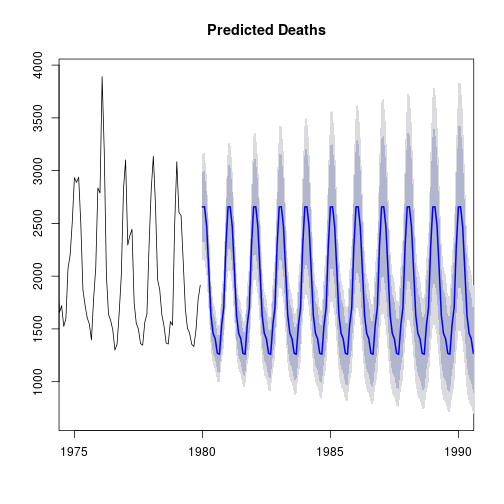

Shiny App: Respiratory Illness Deaths
========================================================
author: R. Holley
date: June 3rd, 2020
autosize: true
Developing Data Products, Coursera & Johns Hopkins University

What's Going On?
========================================================

With Covid-19 still affecting millions of people worldwide, respiratory illness has come to the forefront as a major topic of interest. People want to know:

- Is this normal?
- How serious is this?
- Am I at risk?

This app is the first step in helping them answer those questions, and has the potentional for wide-spread education and awareness benefits. The next slide contains some simple forecasting example code, with the plot generated on Slide 3.

UK Data Example
========================================================

The provided dataset, *UKLungDeaths*, is a time series giving the monthly deaths from bronchitis, emphysema, and asthma in the UK from 1974-1979 (all sexes). Respiratory illnesses such as these greatly complicate Covid-19 cases, so tracking their patterns and prevalence is helpful for medical staff and the population at large to track their risk factors.


```r
library(forecast)
data(UKLungDeaths)
f1 <- forecast(ldeaths, h=150)
plot(f1, xlim=c(1975,1990), main="Predicted Deaths")
```

Example Prediction
========================================================


***
As a prototype, there are still several advancements needed to make this app fully functional. The provided dataset, while convenient and simple to analyze, is out-of-date and lacking useful demographic information. Some upcoming improvements include:
 - larger, up-to-date dataset
 - variables for demographic information
 - greater server power (RAM) for big data processing


Specs + Sources
========================================================

R version 3.6.3 (2020-02-29) -- "Holding the Windsock"
Copyright (C) 2020 The R Foundation for Statistical Computing

R Packages:
- shiny 1.4.0.2
- forecast 8.12

Data:  
*UKLungDeaths* P. J. Diggle (1990) Time Series: A Biostatistical Introduction. Oxford, table A.3
